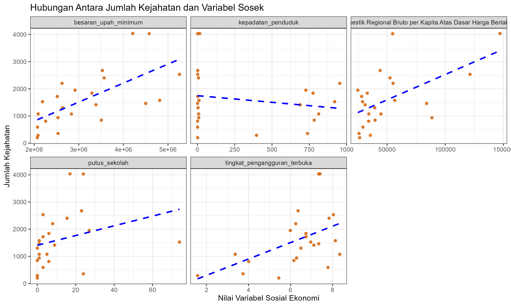

  

# Analisis Tingkat Kriminalitas di Provinsi Jawa Barat Tahun 2024

## Struktur Folder
- `data/raw/` : data mentah (tidak diubah manual)
- `data/processed/` : data setelah dibersihkan (missing value, transformasi)
- `scripts/` : kode R untuk import data, fitting model, evaluasi
- `results/figures/` : visualisasi model dan error
- `results/tables/` : ringkasan metrik evaluasi (RMSE, MAE)
- `docs/` : catatan analisis / draft laporan

## 1. Latar Belakang
Penelitian ini ...

## 2. Tujuan Penelitian

## 3. Data dan Variabel

  
  

### Variabel Penjelas (X)
- Upah Minimum Kabupaten
- Kepadatan Penduduk
- Produk Domestik Regional Bruto (PDRB)
- Tingkat Pengangguran Terbuka
- Jumlah Putus Sekolah

### Variabel Respon (Y)
- Jumlah Kejahatan yang dilaporkan

### Dataset
| No | Satuan Wilayah Hukum      | Jumlah Kejahatan | Upah Minimum Kab. | Kepadatan Penduduk |  PDRB  | T. Pengangguran Terbuka | Putus Sekolah |
|----|---------------------------|------------------|-------------------|--------------------|--------|-------------------------|---------------|
| 1  | Polres Bogor              | 4030             | 4579541           | 1.942              | 54857  | 7.34                    | 24            |
| 2  | Polres Ciamis             | 1077             | 2089464           | 813                | 34336  | 3.37                    | 5             |
| 3  | Polres Cianjur            | 1951             | 2915102           | 727                | 24914  | 5.99                    | 27            |
| …  | …                         | …                | …                 | …                  | …      | …                       | …             |
| 21 | Polresta Kota Bogor       | 1576             | 4813988           | 10.273             | 56616  | 8.13                    | 1             |
| 22 | Polresta Cirebon          | 1719             | 2517730           | 2.312              | 28140  | 6.74                    | 3             |
| 23 | Polrestabes Kota Bandung  | 4036             | 4209309           | 15.557             | 147081 | 7.4                     | 17            |

### Scatterplot Variabel X terhadap Y

  

## 3. Metodologi

## 4. Tahapan analisis
1. Mengumpulkan data dari berbagai pangkalan data.
2. Melakukan eksplorasi data dengan mendeskripsikan data yang diperoleh.
3. Menguji sebaran pada peubah respon, apakah benar memiliki sebaran poisson atau tidak.
4. Menentukan model regresi poisson.
5. Mengidentifikasi overdisprsi dengan mengitung nilai koefisien disperse.
6. Menentukan model regresi binomial negatif.
7. Menghitung nilai AIC untuk memilih model terbaik

## 5. Visualisasi
### Peta Kriminalitas Jawa Barat

  

## 👥 Team Members

  <a href="https://github.com/sigapafalah">
    
     <b>Sigap Abror Falah</b>
  </a>
  &nbsp;&nbsp;&nbsp;&nbsp;
  <a href="https://github.com/Lenipamularsih">
    
     <b>Leni Pamularsih</b>
  </a>
  &nbsp;&nbsp;&nbsp;&nbsp;
  <a href="https://github.com/wiliasondriva">
    
     <b>Wilia Sondriva</b>
  </a>
  &nbsp;&nbsp;&nbsp;&nbsp;
  <a href="https://github.com/lilikavitaa">
    
     <b>Lilik Avitadia Prichanti</b>
  </a>
  &nbsp;&nbsp;&nbsp;&nbsp;
  <a href="https://github.com/aridhapebriani">
    
     <b>Aridha Pebriani Kusmiran</b>
  </a>

