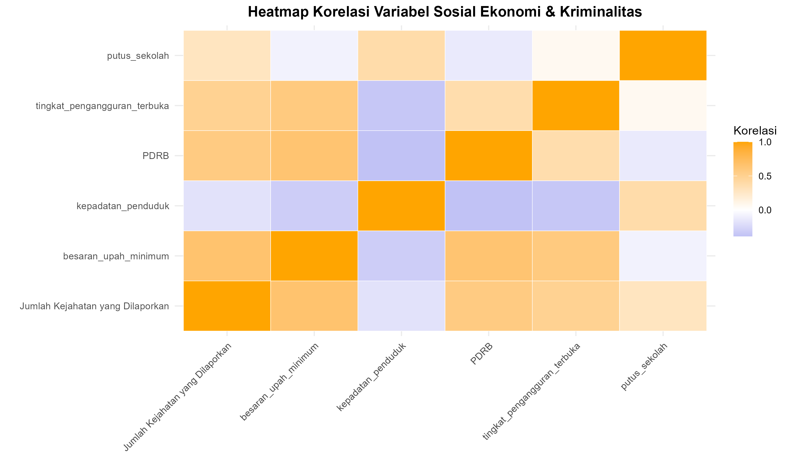

# 🚔 Analisis Faktor Sosial Ekonomi terhadap Tingkat Kriminalitas di Jawa Barat Tahun 2024 Menggunakan Regresi Binomial Negatif

---

 
 

Proyek ini menganalisis data kriminalitas di 23 wilayah hukum (Polres/Polresta/Polrestabes) di Jawa Barat dan hubungannya dengan faktor-faktor sosial ekonomi.
Karena data kriminalitas (data cacahan) terbukti mengalami **overdispersi**, proyek ini menggunakan **Regresi Binomial Negatif** sebagai model analisis utama.

---

## 📚 Latar Belakang
Kriminalitas di Jawa Barat pada tahun 2024 menunjukkan variasi yang cukup tinggi di antara 23 wilayah hukum. Perbedaan tingkat kejahatan ini diduga dipengaruhi oleh kondisi sosial ekonomi masyarakat, seperti pendapatan, kepadatan penduduk, pengangguran, serta angka putus sekolah. Faktor-faktor tersebut sering dikaitkan dengan tekanan ekonomi dan sosial yang dapat meningkatkan risiko kejahatan.

Data kriminalitas yang digunakan merupakan data cacahan (count data). Hasil eksplorasi awal menunjukkan adanya overdispersi, sehingga model regresi Poisson tidak lagi sesuai. Untuk itu, Regresi Binomial Negatif dipilih karena mampu menangani varians data yang lebih besar daripada mean sehingga memberikan estimasi yang lebih akurat.

Penelitian ini bertujuan untuk menganalisis pengaruh faktor sosial ekonomi terhadap tingkat kriminalitas dan menentukan model terbaik dalam menjelaskan variasi tersebut.

---

## 📌 Tujuan Penelitian
- Menganalisis pengaruh faktor sosial ekonomi—seperti upah minimum, kepadatan penduduk, PDRB, tingkat pengangguran terbuka, dan jumlah putus sekolah—terhadap tingkat kriminalitas di 24 wilayah hukum di Jawa Barat pada tahun 2024.
- Mengidentifikasi apakah terjadi overdispersi pada data jumlah kejahatan yang dilaporkan sehingga model regresi Poisson kurang sesuai digunakan.
- Membangun model Regresi Binomial Negatif sebagai pendekatan yang tepat untuk data kriminalitas yang mengalami overdispersi.
- Membandingkan kualitas model melalui nilai AIC untuk menentukan model terbaik dalam memprediksi jumlah kejahatan berdasarkan variabel sosial ekonomi.

---

## 📁 Data dan Variabel

  
  &nbsp;&nbsp;&nbsp;&nbsp;
  

### Variabel Penjelas (X)
- 💵 Upah Minimum Kabupaten  
- 👥 Kepadatan Penduduk  
- 📊 Produk Domestik Regional Bruto (PDRB)  
- 🏃‍♂️ Tingkat Pengangguran Terbuka  
- 🏫 Jumlah Putus Sekolah

### Variabel Respon (Y)
- 🚨 Jumlah Kejahatan yang dilaporkan

### Dataset
| No | Satuan Wilayah Hukum      | Jumlah Kejahatan | Upah Minimum Kab. | Kepadatan Penduduk |  PDRB  | T. Pengangguran Terbuka | Putus Sekolah |
|----|---------------------------|------------------|-------------------|--------------------|--------|-------------------------|---------------|
| 1  | Polres Bogor              | 4030             | 4579541           | 1.942              | 54857  | 7.34                    | 24            |
| 2  | Polres Ciamis             | 1077             | 2089464           | 813                | 34336  | 3.37                    | 5             |
| 3  | Polres Cianjur            | 1951             | 2915102           | 727                | 24914  | 5.99                    | 27            |
| …  | …                         | …                | …                 | …                  | …      | …                       | …             |
| 21 | Polresta Kota Bogor       | 1576             | 4813988           | 10.273             | 56616  | 8.13                    | 1             |
| 22 | Polresta Cirebon          | 1719             | 2517730           | 2.312              | 28140  | 6.74                    | 3             |
| 23 | Polrestabes Kota Bandung  | 4036             | 4209309           | 15.557             | 147081 | 7.4                     | 17            |

### Eksplorasi Data Awal

  
   
   <i>Gambar 1. Heatmap korelasi</i>

**Interpretasi Pola Korelasi Variabel Sosial Ekonomi dan Kriminalitas**

Hasil visualisasi heatmap menunjukkan bahwa hubungan antara sebagian besar variabel sosial ekonomi dan tingkat kriminalitas cenderung positif. Pola ini mengindikasikan bahwa kabupaten/kota dengan kondisi sosial ekonomi tertentu memperlihatkan kecenderungan peningkatan tingkat kejahatan yang searah dengan naiknya nilai variabel-variabel tersebut. Secara lebih terperinci, beberapa poin penting dapat dijelaskan sebagai berikut.
1. Variabel Ekonomi Makro  
Variabel PDRB per kapita dan besaran upah minimum menunjukkan korelasi positif yang cukup kuat dengan tingkat kriminalitas. Pola ini umum dijumpai pada wilayah perkotaan atau pusat pertumbuhan ekonomi, di mana aktivitas ekonomi yang tinggi diiringi oleh: 
a. Peningkatan arus mobilitas penduduk, barang, dan uang;  
b. Heterogenitas sosial yang lebih besar; serta  
c. Peluang terjadinya kejahatan yang lebih luas (misalnya pencurian, penipuan, atau tindak kriminal yang mengikuti transaksi ekonomi).  
Korelasi ini tidak dapat langsung diinterpretasikan sebagai hubungan sebab-akibat. Namun, hal ini menegaskan bahwa wilayah dengan dinamika ekonomi tinggi cenderung memiliki risiko kriminalitas yang lebih besar akibat kompleksitas interaksi sosial dan tingginya aktivitas ekonomi.

2. Kondisi Pasar Tenaga Kerja  
Variabel tingkat pengangguran terbuka juga memperlihatkan korelasi positif. Secara teoretis, pengangguran mencerminkan tekanan sosial-ekonomi yang dialami individu dalam kelompok usia kerja, sehingga berpotensi meningkatkan:  
a. Kerentanan terhadap stres ekonomi;  
b. Risiko keterlibatan dalam aktivitas ilegal;  
c. Ketimpangan sosial, yang pada gilirannya membuka peluang bagi terjadinya tindak kriminal. 
Dengan demikian, daerah dengan pengangguran terbuka yang tinggi umumnya memiliki tingkat kriminalitas yang lebih besar.

3. Faktor Pendidikan  
Variabel putus sekolah menunjukkan korelasi positif terhadap kriminalitas. Fenomena ini sejalan dengan literatur yang menyebutkan bahwa tingkat pendidikan yang rendah berkaitan dengan:  
a. Terbatasnya keterampilan kerja;  
b. Rendahnya daya saing di pasar tenaga kerja;  
c. Paparan terhadap lingkungan sosial yang berisiko; serta  
d. Minimnya pengetahuan mengenai konsekuensi hukum.  
Akibatnya, kelompok dengan tingkat pendidikan rendah lebih rentan terhadap dinamika sosial-ekonomi yang dapat mendorong keterlibatan dalam tindak kriminal.

---

## 🧩 Tahapan analisis
1. Mengumpulkan data dari berbagai pangkalan data.
2. Melakukan eksplorasi data dengan mendeskripsikan data yang diperoleh.
3. Menguji sebaran pada peubah respon, apakah benar memiliki sebaran poisson atau tidak.
4. Menentukan model regresi poisson.
5. Mengidentifikasi overdisprsi dengan mengitung nilai koefisien disperse.
6. Menentukan model regresi binomial negatif.
7. Menghitung nilai AIC untuk memilih model terbaik

---
## 🔬 Alur Analisis dan Temuan Utama

Proyek ini dibagi menjadi tiga tahap utama yang saling berurutan:

`Data Mentah` → `Tahap 1: Data Wrangling` → `Tahap 2: Analisis & Visualisasi (EDA)` → `Tahap 3: Pemodelan Regresi` → `Kesimpulan`

### Tahap 1: Persiapan Data (Wrangling)

Data kriminalitas (level Polres) dan data sosial ekonomi (level Kab/Kota) tidak dapat langsung digabung. Kami melakukan proses *wrangling* untuk menyatukan 27 wilayah administrasi Kab/Kota ke dalam 24 wilayah hukum Polres yang sesuai.

**Contoh Kasus:** Data Sosial ekonomi untuk "Kab. Bandung Barat" dan "Kota Cimahi" diagregasi (dirata-rata) untuk mencerminkan satu entitas wilayah hukum, yaitu "Polres Cimahi".

### Tahap 2: Analisis Eksploratif (EDA) & Visualisasi Peta

Sebelum memodelkan, kami melakukan EDA untuk memahami karakteristik data.

#### Temuan Kunci 1: Distribusi Data Sangat Miring (Right-Skewed)

Histogram Jumlah Kejahatan menunjukkan bahwa sebagian besar wilayah hukum memiliki tingkat kejahatan yang relatif rendah, namun ada beberapa wilayah (seperti Polres Bogor dan Polrestabes Bandung) dengan tingkat kejahatan yang sangat tinggi.

  
  <i>Gambar 2. Distribusi Jumlah Kriminalitas</i>

#### Temuan Kunci 2: Visualisasi Peta Sebaran Kriminalitas

Wilayah dengan warna yang lebih gelap (merah) menunjukkan jumlah laporan kejahatan yang lebih tinggi. Terlihat bahwa wilayah yang berdekatan dengan Jakarta (Bogor, Depok, Bekasi) dan wilayah metropolitan Bandung Raya memiliki tingkat kriminalitas yang lebih tinggi.

  
  <i>Gambar 3. Peta Sebaran Kriminalitas</i>

### Tahap 3: Pemodelan Regresi (Mengapa Binomial Negatif?)

Tujuan kami adalah memodelkan "Jumlah Kejahatan" (Variabel Y) menggunakan faktor sosial ekonomi (Variabel X).

#### Temuan Kunci 3: Terdeteksi Overdispersi Kuat

Langkah pertama dalam pemodelan data cacahan adalah memeriksa rasio varians terhadap mean.
* **Mean (Rata-rata)** Jumlah Kejahatan: `2219.04`
* **Varian** Jumlah Kejahatan: `1114839.95`

**Varian (1.1 Juta) jauh lebih besar daripada Mean (2 Ribu)**.

Ini disebut **Overdispersi**. Hal ini melanggar asumsi dasar Regresi Poisson (dimana Mean ≈ Varian) dan membuktikan bahwa **model Poisson tidak akan cocok** untuk data ini.

#### Temuan Kunci 4: Perbandingan Model (AIC)

Kami membandingkan dua model untuk mengatasi ini:
1.  **Regresi Poisson:** Model standar untuk data cacahan (asumsi Mean=Varian).
2.  **Regresi Binomial Negatif:** Model yang lebih fleksibel, dirancang khusus untuk menangani overdispersi.

| Model | Nilai AIC | Keterangan |
| :--- | :--- | :--- |
| Regresi Poisson (`glm`) | 6074.49 | Sangat buruk (karena overdispersi) |
| **Regresi Binomial Negatif (`glm.nb`)** | **373.09** | **LEBIH BAIK** |

**Hasil:** Nilai AIC Regresi Binomial Negatif (373.09) secara drastis lebih rendah daripada Poisson (6074.49). Ini secara statistik mengkonfirmasi bahwa **Regresi Binomial Negatif adalah model yang paling tepat dan valid** untuk menganalisis data kriminalitas Jawa Barat.

**Model Regresi Binomial Negatif**

  

---

## 🏁 Kesimpulan

1.  Data kriminalitas di Jawa Barat (level Polres) menunjukkan karakteristik **data cacahan yang mengalami overdispersi kuat**, sehingga tidak dapat dianalisis dengan regresi linear biasa atau Regresi Poisson.
2.  Visualisasi peta menunjukkan bahwa tingkat kriminalitas cenderung lebih tinggi di wilayah urban dan sub urban yang padat penduduk (sekitar Jakarta dan Bandung Raya).
3.  Model **Regresi Binomial Negatif** terbukti sebagai model yang paling robust dan akurat secara statistik (AIC terendah) untuk menjelaskan hubungan antara faktor sosial ekonomi dan tingkat kriminalitas di Jawa Barat.

---

## 👥 Team Members
<table align="center">
  <tr>
    <td align="center">
      <a href="https://github.com/sabrorfalah-maker">
        
         <b>Sigap Abror Falah</b>
      </a>
    </td>
    <td align="center">
      <a href="https://github.com/Lenipamularsih">
        
         <b>Leni Pamularsih</b>
      </a>
    </td>
    <td align="center">
      <a href="https://github.com/wiliasondriva">
        
         <b>Wilia Sondriva</b>
      </a>
    </td>
    <td align="center">
      <a href="https://github.com/lilikavitaa">
        
         <b>Lilik Avitadia Prichanti</b>
      </a>
    </td>
    <td align="center">
      <a href="https://github.com/aridhapebriani">
        
         <b>Aridha Pebriani Kusmiran</b>
      </a>
    </td>
  </tr>
</table>

---
